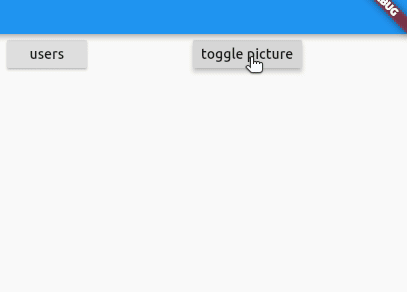

# flutter example of provider with multiple http calls

## SingleChildScroll view inside of Expanded


1. The scrollable window is in a column.
1. The first child of the column is a row.
1. The second child of the column is an `Expanded` widget.
1. Inside of the `Expanded` widget is the `SingleChildScrollView`

```dart
Expanded(
    child: SingleChildScrollView(
    child:
        Text(Provider.of<MainResponseWindow>(context).responseText),
    ),
),
```

## Scrollable ListView



```dart
Widget build(BuildContext context) {
return Container(
    width: 300.0,
    child: ListView(children: [
    Image.network('https://picsum.photos/400/200?random=1'),
    SizedBox(
        height: 12.0,
    ),
```