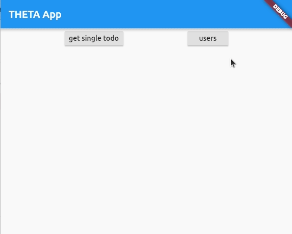

# flutter example of provider with multiple http calls



1. The scrollable window is in a column.
1. The first child of the column is a row.
1. The second child of the column is an `Expanded` widget.
1. Inside of the `Expanded` widget is the `SingleChildScrollView`

```dart
Expanded(
    child: SingleChildScrollView(
    child:
        Text(Provider.of<MainResponseWindow>(context).responseText),
    ),
),
```